## R Markdown
Group Project 1
Geog 456 Geovisualizing change
Devon Maloney 
1/29/2020

To set up the data, I seperated the national individual records of data and place into counts of incidents per month in excell by using the COUNTIF function for all unique month + year combinations. I did this again for just the New Jersery data, a state with a more complete record of hate crime data collection. 

## Packages and Directory


```
## Parsed with column specification:
## cols(
##   Monthyear = col_double(),
##   incident = col_double(),
##   Year = col_double(),
##   Month = col_double()
## )
```

```
## Parsed with column specification:
## cols(
##   Monthyear = col_double(),
##   incident = col_double(),
##   Year = col_double(),
##   Month = col_character()
## )
```

Look at the data 

```r
summary(hatedata)
```

```
##    Monthyear         incident           Year          Month      
##  Min.   :199101   Min.   : 287.0   Min.   :1991   Min.   : 1.00  
##  1st Qu.:199710   1st Qu.: 511.8   1st Qu.:1997   1st Qu.: 3.75  
##  Median :200406   Median : 591.5   Median :2004   Median : 6.50  
##  Mean   :200406   Mean   : 594.0   Mean   :2004   Mean   : 6.50  
##  3rd Qu.:201103   3rd Qu.: 678.2   3rd Qu.:2011   3rd Qu.: 9.25  
##  Max.   :201712   Max.   :1942.0   Max.   :2017   Max.   :12.00
```

```r
summary (hatedataNJ)
```

```
##    Monthyear         incident           Year         Month          
##  Min.   :199101   Min.   :  4.00   Min.   :1991   Length:324        
##  1st Qu.:199710   1st Qu.: 40.00   1st Qu.:1997   Class :character  
##  Median :200406   Median : 53.00   Median :2004   Mode  :character  
##  Mean   :200406   Mean   : 55.49   Mean   :2004                     
##  3rd Qu.:201103   3rd Qu.: 69.00   3rd Qu.:2011                     
##  Max.   :201712   Max.   :177.00   Max.   :2017
```


## Bar graphs for seasonality 
Make a bar graph with a title, axis labels and caption with simple ggplot bar graph. 


```r
p = ggplot(hatedata, aes(x=Month, y = incident)) + geom_bar(stat="identity") 
pnj = ggplot(hatedataNJ, aes(x=Month, y = incident)) + geom_bar(stat="identity") 

#Add labels
p = p + labs(title="Seaonality of hate crimes", x ="Month", y = "Number of indicdents", subtitle = "National rates", caption = "(based on data from the FBI)") 
p 
```

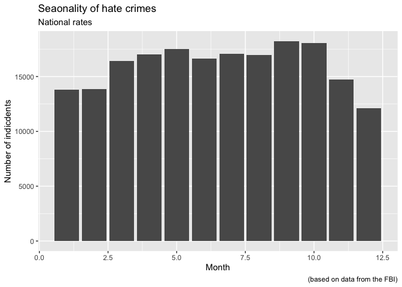<!-- -->

Repeat with New Jersey data: 


```r
pnj = pnj + labs(title="Seaonality of hate crimes", x ="Month", y = "Number of indicdents", subtitle = "New Jersey rates", caption = "(based on data from the FBI)") 
pnj 
```

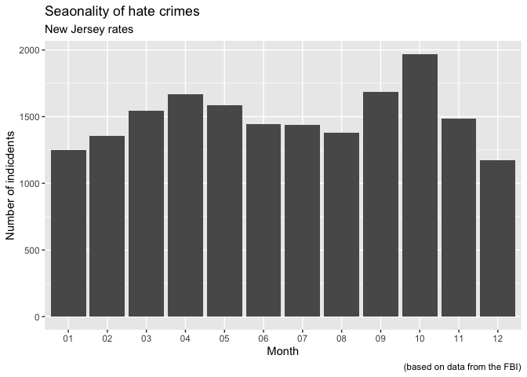<!-- -->

## Warming stripes
Now make the monthly graphs into a warming stripe graph.


```r
# National  
# Colors 
p = p + aes(fill = incident) # assign gradient of blue color to the temp value 
p = ggplot(hatedata, aes(x=Monthyear, y = incident, fill = incident)) + geom_bar(stat="identity")

# Look at the brewer color library and select a nice color gradient. We will select "RdYlBlu". 
display.brewer.all() 
```

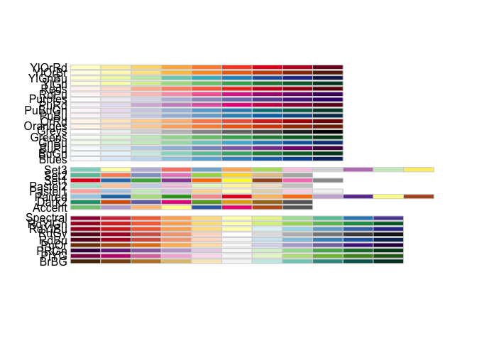<!-- -->

```r
p + scale_fill_gradientn(colours = colorRampPalette(brewer.pal(11,"RdYlBu"))(11)) # red to blue  
```

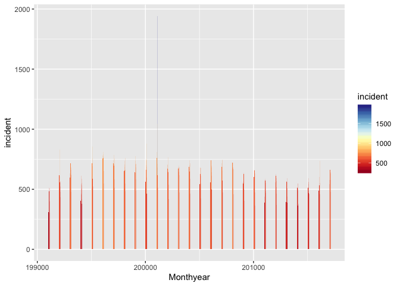<!-- -->

```r
p <- p + scale_fill_gradientn(colours = colorRampPalette(rev(brewer.pal(11,"RdYlBu")))(11)) # REV to adjust scale from blue to red 
p
```

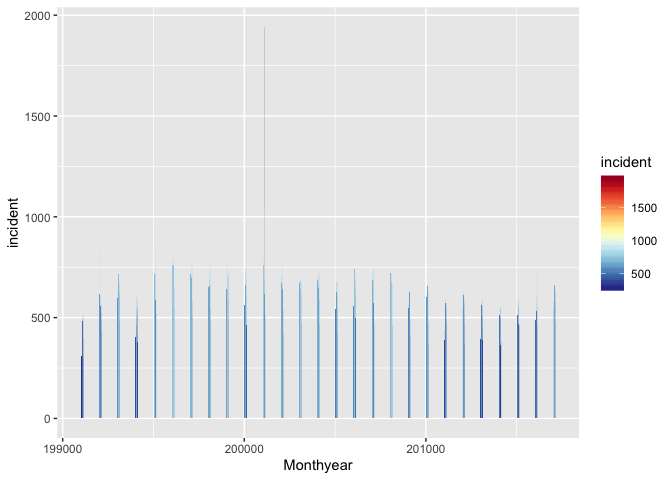<!-- -->

```r
p + aes(y = 300) # make it warming stripes
```

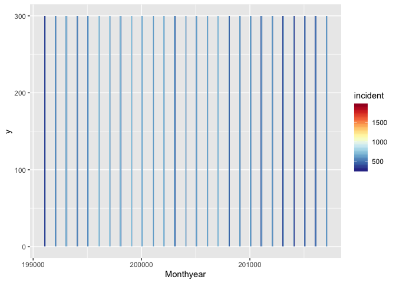<!-- -->

```r
p + aes(x = as.factor(Monthyear), y = 300) # to avoid missing stripes, make yearmonth a factor 
```

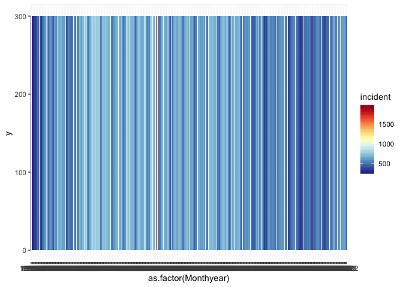<!-- -->

```r
# Add add minial theme, legend, titles, axis labels. 
# Ideally, this section would also include a way to label the year on the x axis, but I was unable to do that. 
p + aes(x = as.factor(Monthyear), y = 300) + theme_minimal() + theme(axis.text = element_blank(), axis.title = element_text(), panel.grid.major = element_blank(), panel.grid.minor = element_blank(), legend.position='right') + labs (x= "Month", y = "Incidents", title = "National Incidents of Hate Crime", subtitle = "Monthly from 1991 - 2017", caption = "(based on data from the FBI)")
```

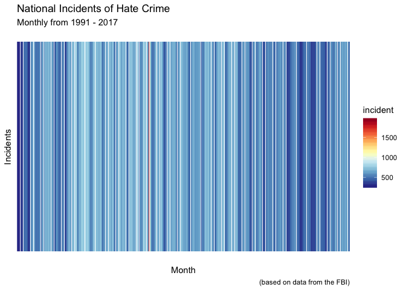<!-- -->

Repeat process for New Jersey data: 


```r
# Colors 
pnj = pnj + aes(fill = incident) # assign gradient of blue color to the temp value 
pnj = ggplot(hatedataNJ, aes(x=Monthyear, y = incident, fill = incident)) + geom_bar(stat="identity")
pnj + scale_fill_gradientn(colours = colorRampPalette(brewer.pal(11,"RdYlBu"))(11)) # red to blue  
```

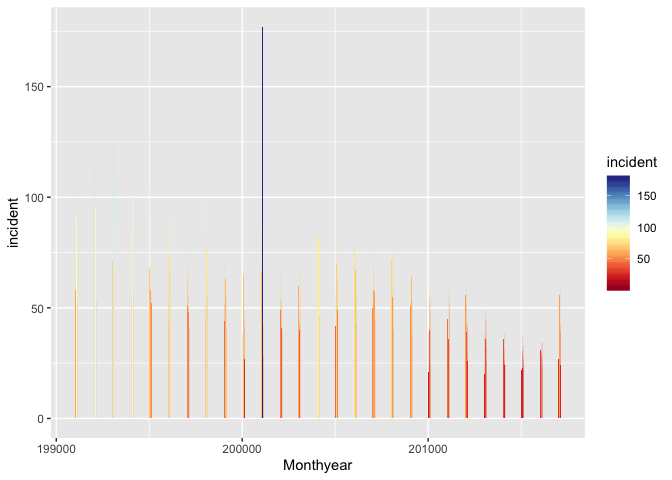<!-- -->

```r
pnj <- pnj + scale_fill_gradientn(colours = colorRampPalette(rev(brewer.pal(11,"RdYlBu")))(11)) # REV to adjust scale from blue to red 
pnj + aes(y = 300) # make it warming stripes
```

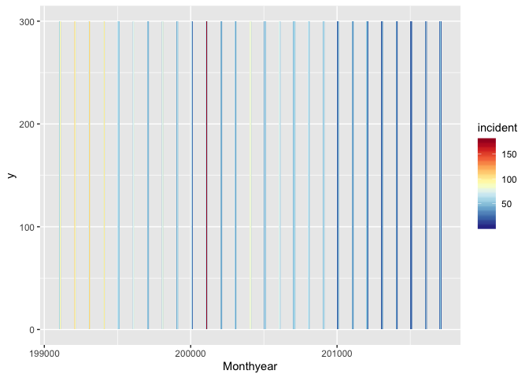<!-- -->

```r
pnj + aes(x = as.factor(Monthyear), y = 300) # to avoid missing stripes, make yearmonth a factor 
```

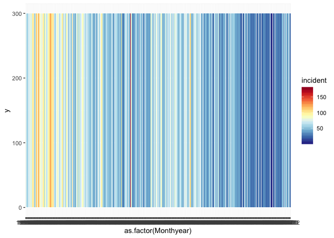<!-- -->

```r
# Add add minial theme, legend, titles, axis labels. 
# Ideally, this section would also include a way to label the year on the x axis, but I was unable to do that. 
pnj + aes(x = as.factor(Monthyear), y = 300) + theme_minimal() + theme(axis.text = element_blank(), axis.title = element_text(), panel.grid.major = element_blank(), panel.grid.minor = element_blank(), legend.position='right') + labs (x= "Month", y = "Incidents", title = "New Jersey Incidents of Hate Crime", subtitle = "Monthly from 1991 - 2017", caption = "(based on data from the FBI)")
```

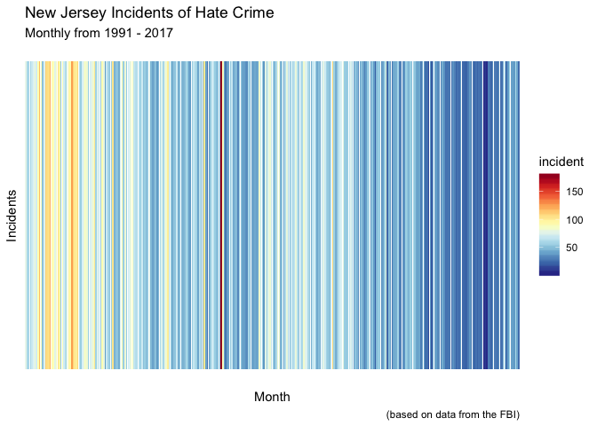<!-- -->


## Seasonality by year
Now make the warming stripes into petals. For this section, the independent variable is swtiched from Monthyear column to Month column. Add add minimal theme, legend, titles, axis labels. 

Issues: I tried to remove the unnessicary axises. Unknown why national graph is on 0.5 month increments and why the NJ is correctly on 1 month incriments. 


```r
# National  
# Colors 
p = p + aes(fill = incident) # assign gradient of blue color to the temp value 
p = ggplot(hatedata, aes(x=Month, y = incident, fill = incident)) + geom_bar(stat="identity")
p + scale_fill_gradientn(colours = colorRampPalette(brewer.pal(11,"RdYlBu"))(11)) # red to blue  
```

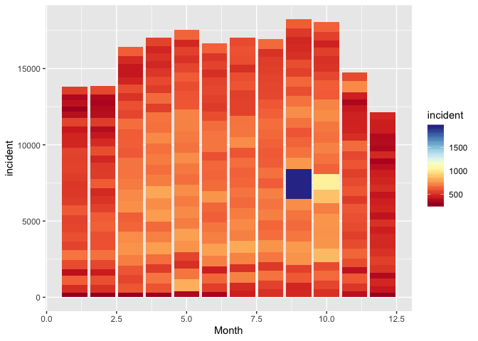<!-- -->

```r
p <- p + scale_fill_gradientn(colours = colorRampPalette(rev(brewer.pal(11,"RdYlBu")))(11)) # REV to adjust scale from blue to red 
p
```

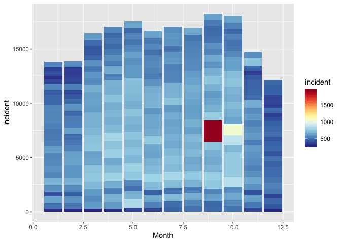<!-- -->

```r
p + aes(y = 300) # make it warming stripes
```

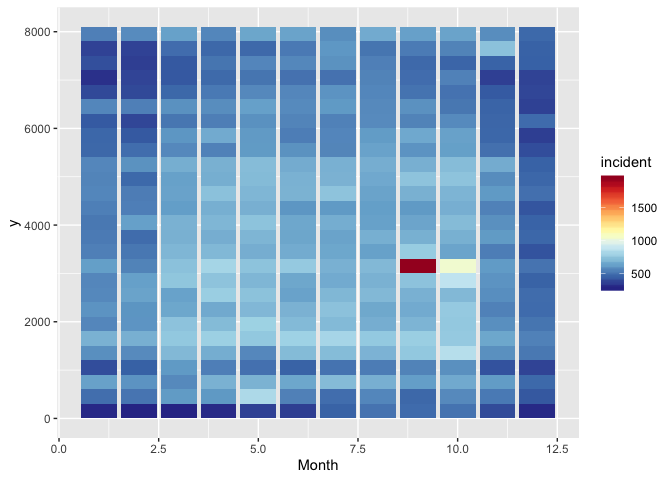<!-- -->

```r
p + aes(x = as.factor(Month), y = 300) # to avoid missing stripes, make month a factor 
```

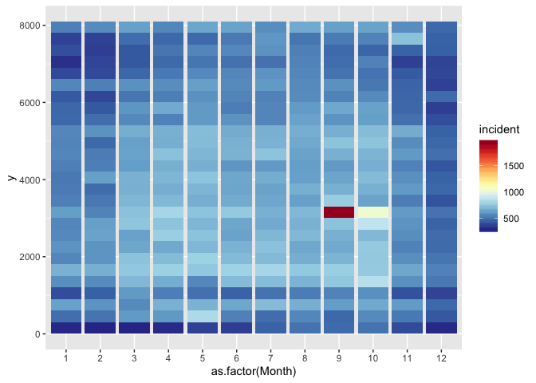<!-- -->

```r
#Add labels 
# Ideally, this section would also include a way to label the year on the x axis. 
p + aes(x = as.factor(Month), y = 300) + theme_minimal() + theme(axis.text = element_blank(), axis.title = element_text(), panel.grid.major = element_blank(), panel.grid.minor = element_blank(), legend.position='right') + labs (x= "Month", y = "Incidents", title = "National Incidents of Hate Crime", subtitle = "Monthly from 1991 - 2017", caption = "(based on data from the FBI)")
```

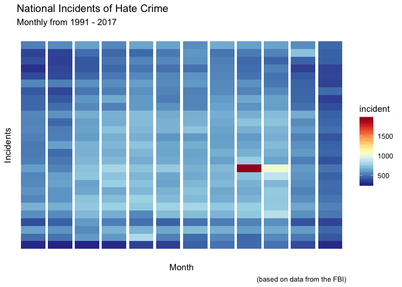<!-- -->

Repeat process for New Jersey data: 


```r
# Colors 
pnj = pnj + aes(fill = incident) # assign gradient of blue color to the temp value 
pnj = ggplot(hatedataNJ, aes(x=Month, y = incident, fill = incident)) + geom_bar(stat="identity")
pnj + scale_fill_gradientn(colours = colorRampPalette(brewer.pal(11,"RdYlBu"))(11)) # red to blue  
```

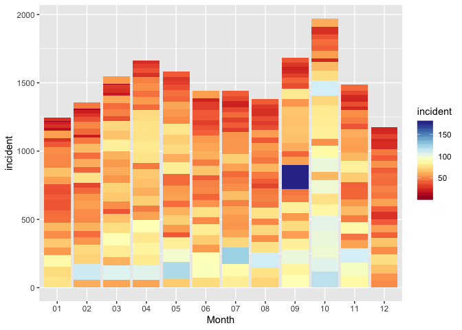<!-- -->

```r
pnj <- pnj + scale_fill_gradientn(colours = colorRampPalette(rev(brewer.pal(11,"RdYlBu")))(11)) # REV to adjust scale from blue to red 
pnj + aes(y = 300) # make it warming stripes
```

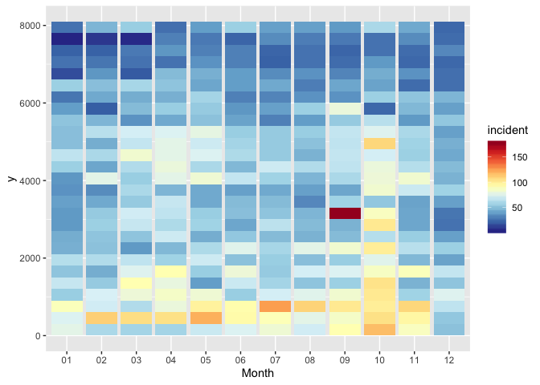<!-- -->

```r
pnj + aes(x = as.factor(Month), y = 300) # to avoid missing stripes, make month a factor 
```

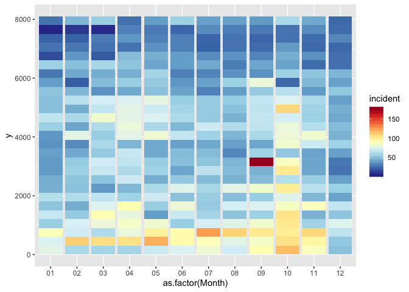<!-- -->

```r
# Add labels
pnj + aes(x = as.factor(Month), y = 300) + theme_minimal() + theme(axis.text = element_blank(), axis.title = element_text(), panel.grid.major = element_blank(), panel.grid.minor = element_blank(), legend.position='right') + labs (x= "Month", y = "Incidents", title = "New Jersey Incidents of Hate Crime", subtitle = "Monthly from 1991 - 2017", caption = "(based on data from the FBI)")
```

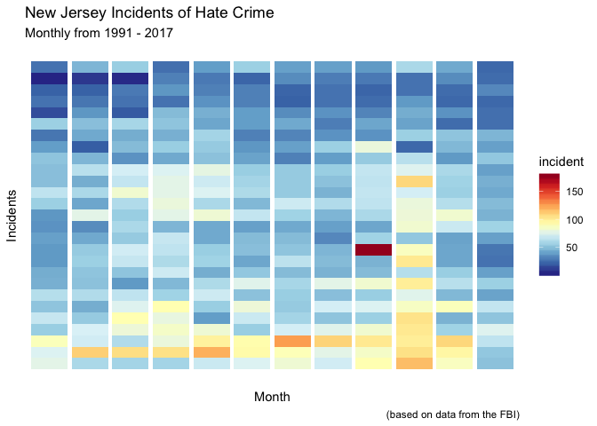<!-- -->

I'm not sure why the final aes() settings make the month ticks and month labels on the x-axis go away. This would be something I would like to include in the final graph. 

## Petal Circles

```r
#Make it into a petal circle 
p + coord_polar(theta = "x") 
```

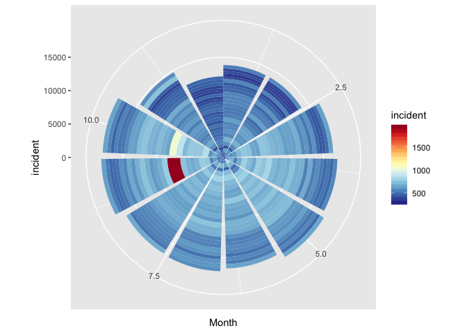<!-- -->

```r
pnj + coord_polar(theta = "x") 
```

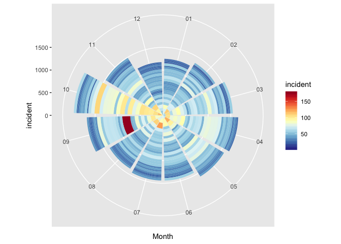<!-- -->

Not sure why the national data had the months diplay in 0.5 month incriments and the NJ data appeared correctly as months. This is something I would like to resolve. 

All data from the FBI National Hate Crime Database. 

